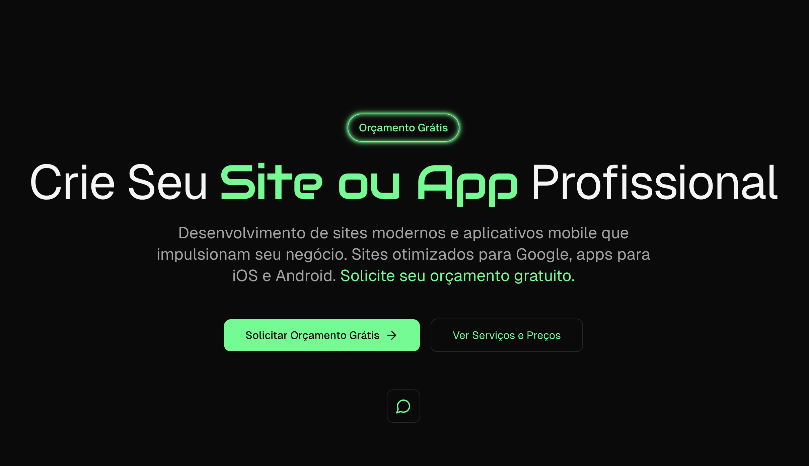
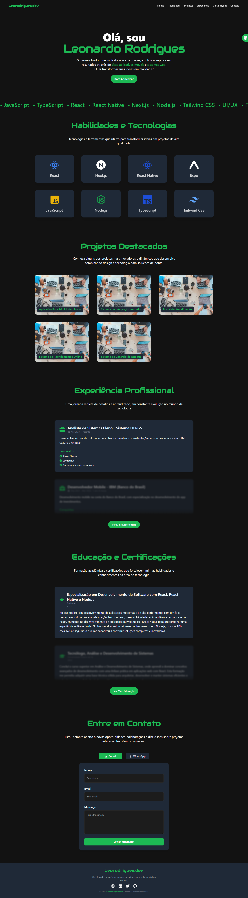

# leorodrigues.dev



<a href="https://leorodrigues.dev">
  <h1 align="center">
    Leorodrigues.dev
  </h1>
</a>
<p align="center">🚀 Portfólio pessoal desenvolvendo e compartilhando projetos incríveis em React, Next.js, Node.js e muito mais!</p>

---
[](https://github.com/ellerbrock/open-source-badges/)

<a href="https://nextjs.org/"></a>
<a href="https://github.com/leorodriguesdev/leorodrigues.dev/issues"></a>
<a href="https://github.com/leorodriguesdev/leorodrigues.dev/network"></a>
<a href="https://github.com/leorodriguesdev/leorodrigues.dev/stargazers"></a>

## 📄 Sumário

- [Sobre](#sobre)
- [Status do Projeto](#status-do-projeto)
- [Features](#features)
- [Pré-requisitos](#pré-requisitos)
- [Instalação](#instalação)
- [Rodando a Aplicação](#rodando-a-aplicação)
- [Tecnologias](#tecnologias)
- [Autor](#autor)
- [📫 Contato](#-contato)
- [📜 Licença](#licença)

## 📝 Sobre

O **leorodrigues.dev** é um portfólio pessoal desenvolvido com [Next.js](https://nextjs.org/), [React](https://reactjs.org/), e [TypeScript](https://www.typescriptlang.org/). Este projeto tem como objetivo apresentar meus trabalhos, habilidades e experiências no desenvolvimento web e mobile.

Com uma interface moderna e responsiva, este portfólio destaca meus projetos mais recentes, competências técnicas e trajetória profissional, proporcionando uma experiência envolvente para quem visita.

## 🚧 Status do Projeto

<h4 align="center"> 
	🚧  Portfólio em desenvolvimento... 🚧
</h4>

## ✅ Features

- [x] Design responsivo e moderno
- [x] Seção de habilidades com animações
- [x] Galeria de projetos interativa
- [x] Formulário de contato com envio via email
- [x] Integração com APIs externas
- [ ] Sistema de autenticação para áreas restritas
- [ ] Blog integrado para compartilhar artigos
- [ ] Otimizações de SEO avançadas

---

<h1 align="center">
  
</h1>

## 📋 Pré-requisitos

Antes de começar, você vai precisar ter instalado em sua máquina as seguintes ferramentas:

- [Git](https://git-scm.com)
- [Node.js](https://nodejs.org/en/) (versão 14 ou superior)
- [Yarn](https://yarnpkg.com/) ou [npm](https://www.npmjs.com/)
- [TypeScript](https://www.typescriptlang.org/) (opcional, se aplicável)

Além disso, é recomendado utilizar um editor de código como o [VSCode](https://code.visualstudio.com/).

## 🛠️ Instalação

Siga os passos abaixo para executar este projeto localmente:

1. **Clone este repositório:**

   ```bash
   git clone https://github.com/leorodriguesdev/leorodrigues.dev.git
   ```

2. **Acesse a pasta do projeto no terminal/cmd:**

   ```bash
   cd leorodrigues.dev
   ```

3. **Instale as dependências:**

   ```bash
   yarn install
   ```

   ou

   ```bash
   npm install
   ```

4. **Configure as variáveis de ambiente:**

   Crie um arquivo `.env.local` na raiz do projeto e adicione suas credenciais de email para o formulário de contato:

   ```env
   EMAIL_USER=seu_email@gmail.com
   EMAIL_PASS=sua_senha_de_app
   EMAIL_DESTINATION=destinatario_email@gmail.com
   ```

   > **Nota:** Utilize senhas de aplicativos ou métodos seguros para proteger suas credenciais.

## 🚀 Rodando a Aplicação

Após instalar as dependências e configurar as variáveis de ambiente, execute a aplicação em modo de desenvolvimento:

```bash
yarn dev
```

ou

```bash
npm run dev
```

A aplicação irá iniciar na porta `3000`. Acesse [http://localhost:3000](http://localhost:3000) no seu navegador para visualizar o projeto.

Para construir a aplicação para produção:

```bash
yarn build
```

ou

```bash
npm run build
```

Em seguida, para iniciar o servidor de produção:

```bash
yarn start
```

ou

```bash
npm start
```

## 💻 Tecnologias

As seguintes ferramentas foram usadas na construção do projeto:

- [Next.js](https://nextjs.org/)
- [React](https://pt-br.reactjs.org/)
- [TypeScript](https://www.typescriptlang.org/)
- [Tailwind CSS](https://tailwindcss.com/)
- [Nodemailer](https://nodemailer.com/)
- [React Hot Toast](https://react-hot-toast.com/)
- [React Icons](https://react-icons.github.io/react-icons/)
- [Axios](https://axios-http.com/docs/intro)
- [PostCSS](https://postcss.org/)
- [ESLint](https://eslint.org/)
- [Autoprefixer](https://github.com/postcss/autoprefixer)

## 👤 Autor

<a href="https://bio.link/leorodriguesdev">
 
 <br />
 <sub><b>Leonardo Rodrigues</b></sub></a> <a href="https://bio.link/leorodriguesdev" title="link leo">⚡</a>

Feito com ❤️ por Leonardo Rodrigues 👋🏽 Entre em contato!

## 📫 Contato

Desenvolvido por **Leonardo Rodrigues**.

- **LinkedIn:** [linkedin.com/in/leorodriguesdev](https://linkedin.com/in/leorodriguesdev)
- **Portfólio:** [leorodrigues.dev](https://www.leorodrigues.dev/)

---

## 📜 Licença

Este projeto está licenciado sob a licença [MIT](./LICENSE).

---

© 2025 Leorodrigues.dev. Todos os direitos reservados.
